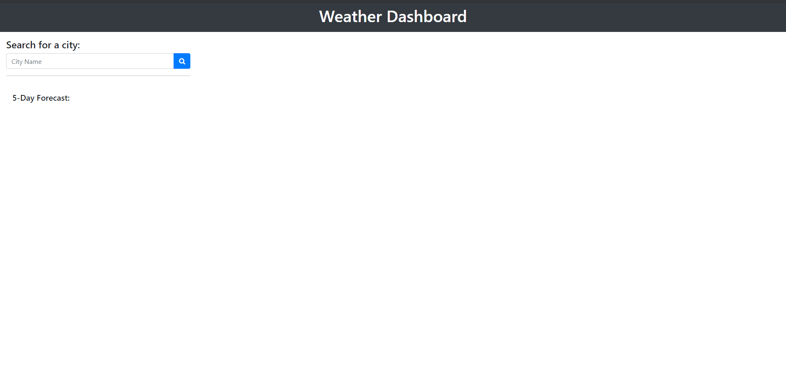
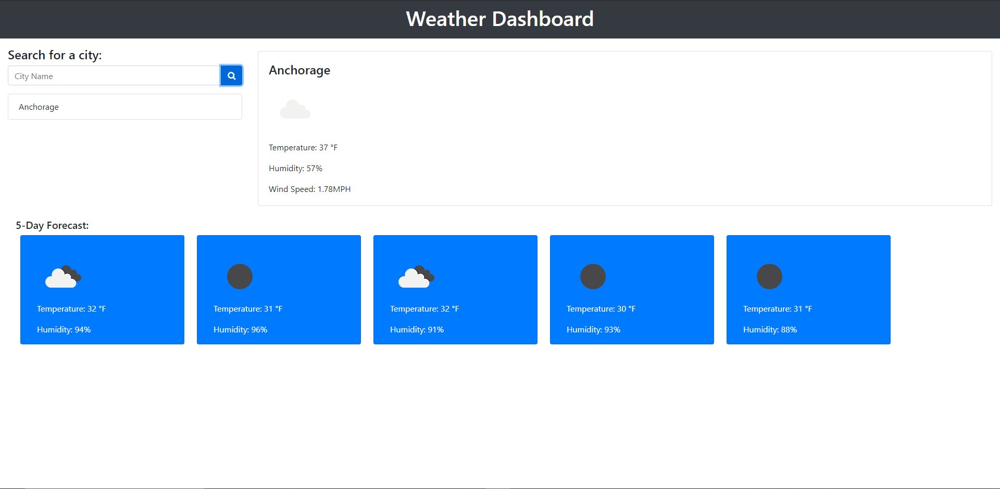

# WeatherDashboard

Link to the deployed page [here](https://rubixcubed39.github.io/WeatherDashboard/)

## Table of Contents
* Overview
* Usage
* Issues
* Author

---

### Overview
---
For this assignment, we had to use the _Openweather API_ to create a dashboard of a searched city and the current weather of said city, along with a 5 day forcast.

### Usage
---
To use the dashboard, you will enter in a city in the search bar.

Once you enter in a city, you will click the search button and the city you searched will pop up along with a 5 day forcast of the city.

### Issues
---
I still have issues getting the rest of the website to fuction as intended, as in switching between cities once there are multiple. I will try to continue working on it.

### Author
---
Christian Faatoafe